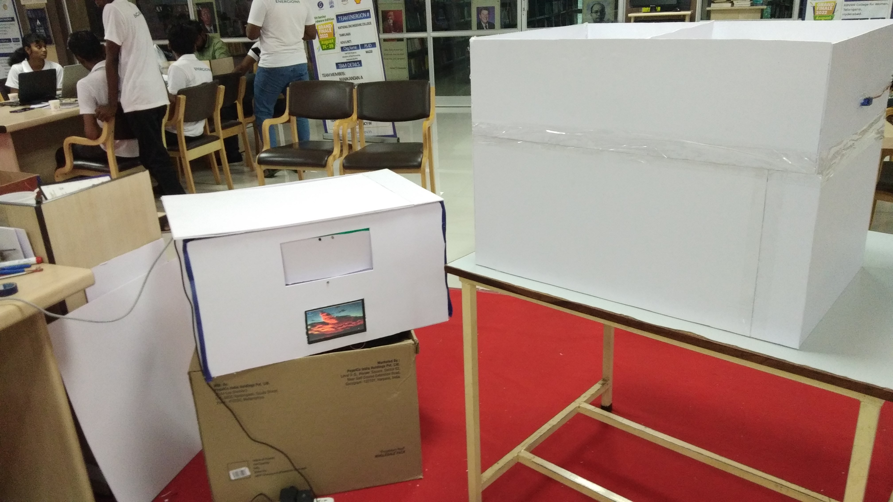

# Money-Plant 🌱
Android application he Money Plant for Smart Bin that we have developed in Smart India Hackathon 2022. This  help government to automatically segregate the waste depending on its type.

  <h2>  </h2>

  

